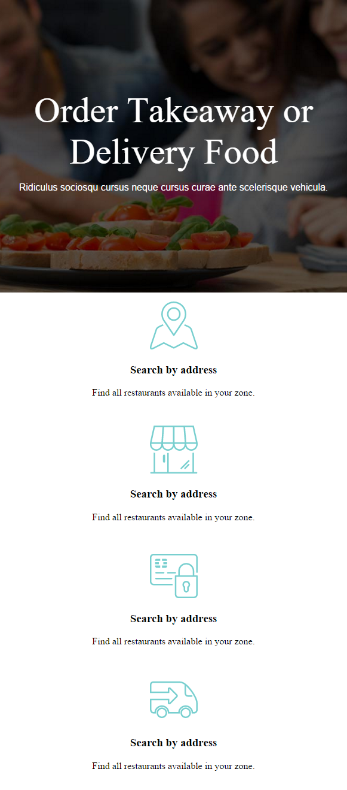

# Bootstrap Framework

### Objective

* Learn how to include Bootstrap
* Create new template
* Learn Bootstrap Grid System

### Reading

* [W3School - Bootstrap Grid system](http://www.w3schools.com/bootstrap/bootstrap_grid_system.asp)
* [Sitepoint - Bootstrap Grid system](http://www.sitepoint.com/understanding-bootstrap-grid-system/)

#  Instruction Plan

### Bootstrap

Bootstrap is a free and open-source collection of tools for creating websites and web applications. It contains HTML- and CSS-based design templates for typography, forms, buttons, navigation and other interface components, as well as optional JavaScript extensions. It aims to ease the development of dynamic websites and web applications.

Visit one the following websites and play with the size of your browser to see it change accordingly 

* http://themepixels.com/demo/webpage/quirk/templates/index.html
* http://abusinesstheme.com/demo/abt/index.html
* http://borisolhor.com/?theme=speedup_html

### Adding Bootstrap to a project

#### Local files

Download the [zip file](https://github.com/twbs/bootstrap/releases/download/v3.3.5/bootstrap-3.3.5-dist.zip). This zip file has 3 folders: css, js, and fonts.


Inside the css folder you will find six files, you will only use `bootstrap.min.css`.


Inside the js folder you will find 3 files, you will only use `bootstrap.min.js`.


> We are not going to use the fonts but if you wish to know more, visit this [page](http://getbootstrap.com/components/#glyphicons).

Copy those files into your project's css and js folder. To use `bootstrap.min.css` you will need to add it as you have been adding other CSS files before. To add `bootstrap.min.js` it's a little different. You will use `script` instead of `link` and `src` instead of `hfer`.

`<script type="text/javascript" src="path/to/js/file.js"></script>`


#### CDN - Content Delivery Network

The following links are taken from [BootstrapCDN by MaxCDN](https://www.bootstrapcdn.com/)

**CSS**

```html
<link href="https://maxcdn.bootstrapcdn.com/bootstrap/3.3.6/css/bootstrap.min.css" rel="stylesheet" integrity="sha384-1q8mTJOASx8j1Au+a5WDVnPi2lkFfwwEAa8hDDdjZlpLegxhjVME1fgjWPGmkzs7" crossorigin="anonymous">
```

**JavaScript**
```html
<script src="https://maxcdn.bootstrapcdn.com/bootstrap/3.3.6/js/bootstrap.min.js" integrity="sha384-0mSbJDEHialfmuBBQP6A4Qrprq5OVfW37PRR3j5ELqxss1yVqOtnepnHVP9aJ7xS" crossorigin="anonymous"></script>
```


### Grid system

Bootstrap includes a responsive, mobile first fluid grid system that appropriately scales up to 12 columns according to the screen size. Grid systems are used for creating page layouts through a series of rows and columns that holds the content.

We will be making three distinctions: phone(sx), tablet(sm), and laptop(md). Now since we have 12 columns in our grid, we can make several combinations that add up to 12, for example:

```html
<!-- It is important to have a column combination encapsulated within a row to perform well -->
<!-- This will result in 3 columns. First one is 4 column wide, second 2 column wide, and third 6 column wide -->
<!-- The total of these columns adds up to 12 -->
<div class="row">
    <div class="col-sm-4">
        This is 4 columns wide
    </div>
    <div class="col-sm-2">
        This is 2 columns wide
    </div>
    <div class="col-sm-6">
        This is 6 columns wide
    </div>
</div>
```

By determining the number of columns for a specific screen size, **all the other screen sizes bigger than the one described will inherit that size** and **all the smaller sized screens will be default to a 12 column width**. When you define a container element like a `div` with `class=col-sm-4`, you are setting a container 4 columns wide for small, medium, and large screen sizes and for extra small screens, it will be 12 columns wide.

#### Offsetion columns

Move columns to the right using `.col-md-offset-*` classes. These classes increase the left margin of a column by * columns. 

```html
<div class="row">
    <div class="col-md-4">.col-md-4</div>
    <div class="col-md-4 col-md-offset-4">.col-md-4 .col-md-offset-4</div>
</div>
<div class="row">
    <div class="col-md-3 col-md-offset-3">.col-md-3 .col-md-offset-3</div>
    <div class="col-md-3 col-md-offset-3">.col-md-3 .col-md-offset-3</div>
</div>
<div class="row">
    <div class="col-md-6 col-md-offset-3">.col-md-6 .col-md-offset-3</div>
</div>

```
### Exercise

Download the following [file](https://github.com/AustinCodingAcademy/HTMLIntroductory/raw/master/archives/13/exercise/enemy.zip) and follow the instructions in class.

<table>
    <tr>
        <th>Screen size</th>
        <th>Column size</th>
        <th>Element</th>
    </tr>
    <tr>
        <td>md</td>
        <td>10</td>
        <td>text</td>
    </tr>
    <tr>
        <td>md</td>
        <td>2</td>
        <td>image</td>
    </tr>
    <tr>
        <td>sm</td>
        <td>8</td>
        <td>text</td>
    </tr>
    <tr>
        <td>sm</td>
        <td>4</td>
        <td>image</td>
    </tr>
    <tr>
        <td>xs</td>
        <td>12</td>
        <td>text</td>
    </tr>
    <tr>
        <td>xs</td>
        <td>12</td>
        <td>image</td>
    </tr>
</table>

### Hands-on

### Homework

This time you will have to use the Bootstrap Grid System to create the layout for each viewport. Download the images [here](https://github.com/AustinCodingAcademy/HTMLIntroductory/raw/master/archives/11/homework/images.zip)

#### Laptop


---

#### Tablet


---

#### Phone

